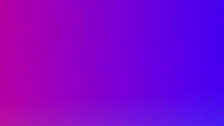

# Custom Shaders 0.9

Custom Shaders is a LUA script for Open Broadcaster Software (OBS) that can be used to apply OBS effects to any image source. An OBS effect (or shader) is defined in a file with a nearly identical syntax to Direct3D 11 HLSL effect files.

## 1. Why another effects add-on?

This script was inspired by the *filter-custom* included in [DarkLink's Script Pack](https://obsproject.com/forum/resources/darklinks-script-pack.655/) and builds upon the features provided by the [obs-shaderfilter](https://obsproject.com/forum/resources/obs-shaderfilter.775/) and the [OBS ShaderFilter Plus](https://obsproject.com/forum/resources/obs-shaderfilter-plus.929/) plugins.

As a Linux user I couldn't use *obs-shaderfilter* because it is only supported for Windows and a tentative compilation lead to nowhere. *OBS ShaderFilter Plus* works very well under Linux and, in some ways, is an improved version of *obs-shaderfilter* but the fact of it being written in Rust, a programming language that is still gaining popularity, makes it very dependent of its developer and casts some shadows over its future.

And so, I turned to the scripting languages that OBS supports and Lua(JIT) became the natural candidate over Python.

## 2. New features

1.  No compilation and no installation of pre-compiled components are required
2.  Cross-platform by nature (although it has only be tested under Linux. I'll be glad to receive some feedback from users of other OSes)
3.  Enlarged support of variable types
4.  Allows the use of vertex or pixel shaders (see below for the conventions adopted)
5.  Full support of image files (textures)

## 3. Installation

*Custom Shaders* is a single file script that can be placed anywhere in your filesystem. Add it to OBS on the `Tools` \> `Scripts` menu and it will be ready to use.

## 4. Usage

1.  Add a filter to a source by right-clicking a source, going to `Filters`, and adding `Custom Shader`. The following default effect will be immediately applied to let you know that the script is working. This effect will also be used as a fallback if any recoverable error happens when an effect file is loaded.

    

2.  Select an effect file by clicking the `Browse` button and picking the file containing the effect source code.

3.  If everything goes well, you can customize the behavior of the shader via the shader-specific user interface (UI).

## 5. Examples

Example shaders may be found in the [`examples`](examples) directory of this repository. It is a good starting point for the creation of custom effects.

## 6. Writing Shaders

Shaders are programs executed on the GPU that apply special visual effects to the rendered graphics. The shaders that can used with this plugin are of two types:

-   ***pixel shaders*** that modify attributes of each pixel in every frame.

    The script will look in the effect file you provide for a line like the following:

    ``` {.hlsl}
    float4 mainImage(VertData v_in) : TARGET
    ```

    with or without an opening bracket at the end. Spaces are irrelevant and the input variable, `v_in`, can be named anything else. If it succedes, it will be assumed that a pixel shader is provided in the file. Otherwise, the following dummy pixel shader will be used:

    ``` {.hlsl}
    float4 mainImage(VertData v_in) : TARGET
    {
       return image.Sample(textureSampler, v_in.uv);
    }
    ```

-   **vertex shaders** that can manipulate properties such as position, color and texture coordinates of points in 2D or 3D space.

    The same as before applies with the following dummy vertex shader:

    ``` {.hlsl}
    VertData mainTransform(VertData v_in)
    {
       VertData vert_out;
       vert_out.pos = mul(float4(v_in.pos.xyz, 1.0), ViewProj);
       vert_out.uv  = v_in.uv;
       return vert_out;
    }
    ```

### 6.1 Supported variables (uniforms) types

| Type          |       Controlled in the UI       |
|:--------------|:--------------------------------:|
| int           |               Yes                |
| int2          |                No                |
| int3          |                No                |
| int4          |                No                |
| float         |               Yes                |
| vec2 / float2 |                No                |
| vec3 / float3 |                No                |
| vec4 / float4 |     Yes (treated as a color)     |
| bool          |               Yes                |
| texture2d     | Yes (as a path to an image file) |

### 6.2 Builtin Variables

To every shader loaded by this script the following uniform variables are added:

| Variable                    | Description                                         |
|:----------------------------|:----------------------------------------------------|
| uniform float4x4 ViewProj;  | Used as the primary view/projection matrix          |
| uniform texture2d image;    | The source image being filtered                     |
| uniform float2 uv_size;     | The width and height of the source image, in pixels |
| uniform float elapsed_time; | The time in seconds since the filter was created    |
| uniform float3 local_time;  | Your OS local time as (hours, minutes, seconds)     |
| uniform float rand_f;       | A random number in [0,1] that changes at each frame |

### 6.3 The user interface

As presented in the fist table above, five types of variables can be controlled in the filter UI. You can further customize the UI elements by including special directives (pragmas) in the effect code. So, for an uniform variable named `speed`, you can write a pragma with up to four parameters:

``` {.hlsl}
#pragma speed 0.0, 10.0, 1.0, 0
```

meaning, in this example, that the variable has a minimum value of 0.0, a maximum value of 10.0, can be changed in steps of 1.0 and it should not be controlled by a slider. Any missing parameter will be replaced by a default value.

The initial value for any variable should always be provided in the code.
